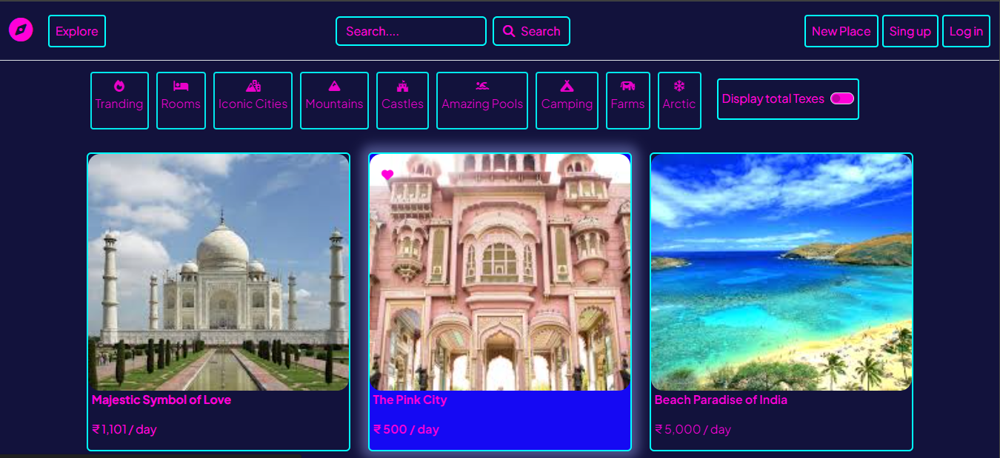
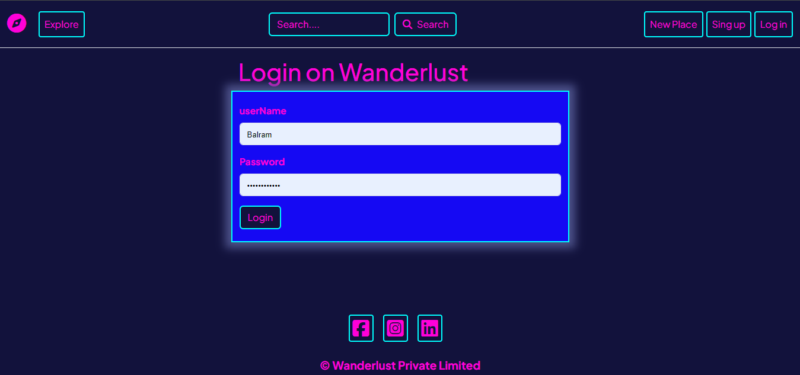
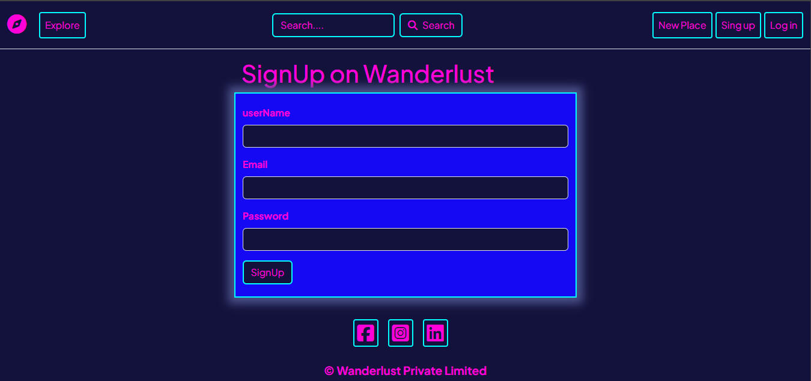
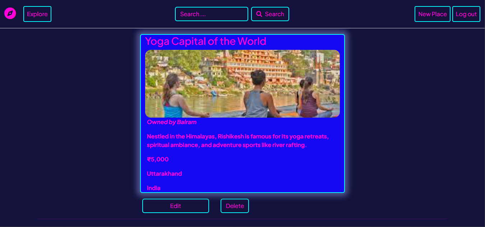
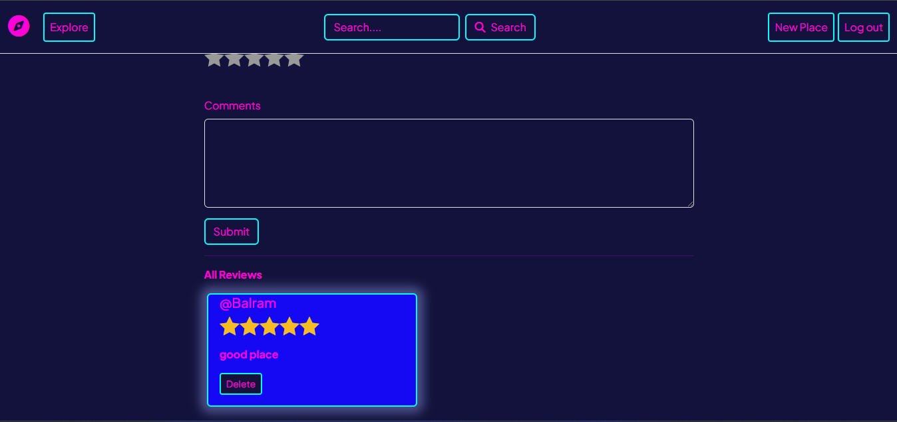

## 🌏 Wanderlust



---

<div>
  <h2> Overview</h2>
</div>

Wanderlust is a full-stack MARN stack application designed to provide a platform similar to Airbnb, where users can search for accommodations, make bookings, and leave reviews. With a sleek and intuitive interface, Wanderlust aims to make finding and booking your next adventure easy and enjoyable.

---

<div>
  <h2>Table of Contents</h2>
</div>

---
- [📑 Features](#-features)
- [🔧 Technologies](#-technologies)
- [⚙️ Installation](#-installation)
- [🚀 Usage](#-usage)
- [📸 Screenshots](#-screenshots)
- [🤝 Contributing](#-contributing)
- [📜 License](#-license)
- [📞 Contact](#-contact)

---

## 📑 Features

- User authentication and authorization
- View detailed listings with photos, descriptions, and reviews
- Make bookings and manage reservations
- Post and view reviews of accommodations
- Responsive design for seamless experience on all devices

---

## 🔧 Technologies

- **JavaScript**: frontend and backend development.
- **Node.js**: server-side scripting.
- **Express.js**: framework for Node.js
- **MongoDB**: Database
- **Cloudinary**: entire image management pipeline.
- **EJS**: HTML markup with plain JavaScript.
- **Joi**: data validator for JavaScript.
- **Multer**: primarily used for uploading files.
- **Passport**: authenticate requests.
- **HTML**: displayed in a web browser.
- **CSS**: describing the presentation
- **Bootstrap**: A front-end framework

---

## ⚙️ Installation

1. **Clone the repository**
    ```bash
    git clone https://github.com/yourusername/wanderlust.git
    cd wanderlust
    ```

2. **Install dependencies**
    ```bash
    npm install
    cd client
    npm install
    cd ..
    ```

3. **Set up environment variables**
    Create a `.env` file in the root directory and add the following:
    ```env
    CLOUD_NAME=cloude_name
CLOUD_API_KEY=cloud_api_key
CLOUD_API_SECRET=cloud_api_secret
ATLASDB_URL=atlas_db
SECRET=secret
    ```

4. **Run the application**
    ```bash
    npm run dev
    ```

---

## 🚀 Usage

1. **Register and log in** to access all features.
2. **Creating Listings** by entering a Various Fields.
3. **View accommodation details** including photos, descriptions, and reviews.
4. **Updating Listing** Anything that you want to updates
5. **Leave a review** after your stay.

---

## 📸 Screenshots


*Homepage*


*Log In*


*Sign Up*


*Listing*


*Review*

---

## 🤝 Contributing

Contributions are welcome! Please fork the repository and create a pull request with your changes. Ensure your code follows the project's coding standards and include relevant tests.

1. Fork the repository
2. Create your feature branch
    ```bash
    git checkout -b feature/YourFeature
    ```
3. Commit your changes
    ```bash
    git commit -m 'Add YourFeature'
    ```
4. Push to the branch
    ```bash
    git push origin feature/YourFeature
    ```
5. Open a pull request

---

## 📜 License

This project is licensed under the MIT License. See the [LICENSE](LICENSE) file for details.

---

## 📞 Contact

For any questions or suggestions, please reach out to:

- **Name**: Balram
- **Email**: balramapply123@gmail.com
- **GitHub**: [yourusername](https://github.com/BalramApply)

---

*Happy wandering with Wanderlust!*
